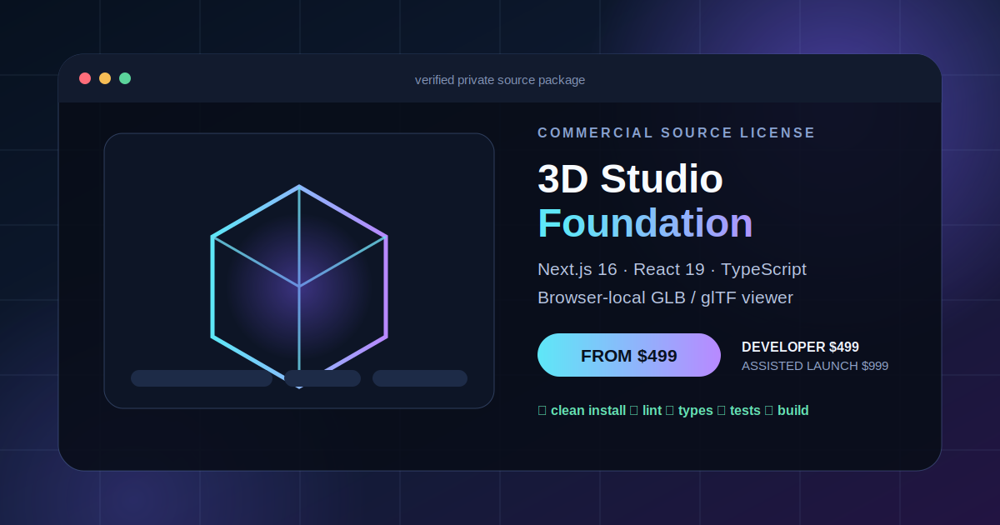

# 3D Studio Foundation — $1,000 Commercial Source License

Private **Next.js 3D viewer source code** for teams building branded GLB/glTF product previews, internal model-review tools, immersive catalog prototypes, or the first interface layer of a custom 3D product.

**Status:** Verified private source package, available for non-exclusive licensing  
**Price:** **$1,000 USD** for one named entity and one commercial end product  
**Delivery:** Pinned private source release after payment verification  
**Support:** Seven calendar days of limited asynchronous setup support  
**Contact:** Cenk Kurtoğlu — cnkkurtoglu@gmail.com

Build a branded browser 3D workspace without starting from an empty repository.

3D Studio Foundation is a clean, brand-neutral Next.js source base extracted from seller-owned engineering work. It is designed for developers, product teams, and agencies that want a working 3D viewer and studio interface while retaining their own brand, infrastructure, business rules, and customer experience.

## Designed for

- agencies that want an inspectable 3D starting point for an upcoming pitch or client build
- product teams prototyping a browser-based GLB/glTF review or catalog experience
- developers who want to spend their time on product-specific data, controls, branding, and workflows instead of rebuilding the studio shell
- one buyer-owned commercial end product; this is not a source-resale or template-redistribution license

## Included

- Next.js 16, React 19, TypeScript, and responsive studio UI
- Interactive GLB/glTF viewing through the packaged open-source viewer dependency
- Browser-only local GLB selection; the buyer's local file is not uploaded to a server by this foundation
- Two newly authored, first-party local glTF samples with embedded geometry
- File validation and display-size boundary tests
- Setup guide, delivery manifest, proprietary notice, third-party notices, and commercial license
- Seven-day limited asynchronous setup/handover window and one buyer-owned deployment/acceptance cycle

## Package verification

The current isolated package has passed:

- clean dependency installation
- ESLint
- TypeScript
- 5/5 unit tests
- Next.js production build and 3/3 generated pages
- production-dependency audit with 0 known vulnerabilities reported at verification time
- HTTP smoke for the studio page and both packaged samples
- source-boundary review excluding production accounts, data, provider code, billing, and Renderivo identity

A real-browser visual interaction check remains a written pre-delivery acceptance item. These checks verify the delivered foundation's stated scope; they do not represent an operating AI generation or billing service.

## Deliberate exclusions

- `renderivo.com`, the Renderivo name, logo, trademark rights, or business identity
- Renderivo users, customer data, analytics, revenue, credentials, API balances, or service accounts
- Authentication, cloud persistence, hosted billing, active AI generation, or provider availability
- Provider-generated or customer-supplied assets
- Rights to resell, redistribute, sublicense, publish, or open-source the foundation itself
- A turnkey operating SaaS business or revenue guarantee

The buyer connects its own infrastructure and providers, pays its own usage costs, and performs its own provider-rights, security, privacy, and production acceptance review.

## License summary

The purchase grants one named individual or legal entity a perpetual, non-exclusive license to modify the private source and use it in one commercial end product for itself or one client. The foundation may not be resold, redistributed, sublicensed, offered as another template/starter, or made public. Dependencies remain governed by their own licenses.

## Separate from the Renderivo acquisition

This license does **not** transfer the Renderivo domain or brand. The separate [$5,000 Renderivo asset acquisition](https://github.com/cekuu35/cekuu35/blob/main/RENDERIVO_ACQUISITION.md) covers the canonical Renderivo asset package and is disclosed as subject to any valid non-exclusive foundation licenses granted before closing.

## Purchase process

1. Buyer identifies the license holder and intended commercial end product.
2. Buyer reviews this scope and, if needed, a sanitized file manifest.
3. Payment is completed through the published checkout or reputable funded escrow.
4. The exact pinned, sanitized source release and written delivery manifest are supplied.
5. The seven-day setup/handover window begins on delivery.

**Purchase inquiry:** [cnkkurtoglu@gmail.com](mailto:cnkkurtoglu@gmail.com?subject=3D%20Studio%20Foundation%20%241000%20source%20license)  
**Product direction:** https://www.renderivo.com/
