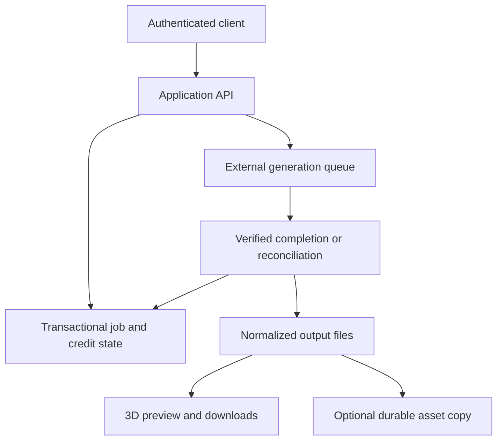

# Renderivo — Reliable asynchronous jobs and credit integrity for AI 3D generation

> **Disclosure boundary:** This public hiring case study intentionally omits credentials, endpoint names, provider and model identities, deployment identifiers, exact thresholds, signature algorithms, internal schemas, and proprietary source. It describes engineering decisions at a level suitable for evaluation without serving as an operational map.

[View the public Renderivo product surface](https://www.renderivo.com/)

## Evidence status

Renderivo is a pre-revenue product foundation. The public site exposes clearly labeled interactive 3D samples. Provider-backed generation is access-controlled; unrestricted public generation, completed live billing, customer scale, revenue, and an independent security audit are not claimed.

The private production repository and its automated tests can be reviewed temporarily during an interview without sharing credentials, customer data, or operational accounts.

## Technology surface

The current foundation uses Next.js, React, TypeScript, a Node.js runtime, Firebase authentication and transactional data storage, an external asynchronous generation service, browser-based GLB inspection, and optional durable object storage.

## The engineering problem

Paid asynchronous APIs create an integrity problem when a request outcome is uncertain. A provider may accept a job even when the application never receives a clean response. Refunding immediately can create an uncharged provider job; charging again on retry can double-charge the user.

Renderivo treats credit state, submission certainty, and terminal job outcome as separate concerns. This makes interrupted requests recoverable and keeps billing decisions tied to verified outcomes.

## Architecture at a safe level of abstraction

The browser is not authoritative for job, plan, or credit changes. Privileged state transitions happen on the server and are recorded transactionally.

## Key design decisions

### Reserve before external spend

Credit is reserved with the job record before an external generation request is made. A verified success captures the reservation; a verified terminal failure refunds it. Retried requests cannot silently create a second reservation for the same client operation.

### Preserve ambiguous submissions for recovery

An interrupted provider request is not automatically treated as a clean rejection. The job remains recoverable until later evidence establishes whether it was accepted or failed. This reduces both free-job and double-charge risk.

### Use more than one completion path

Long-running jobs can be resolved through authenticated status checks, verified callbacks, or scheduled reconciliation. Terminal transitions are idempotent so late or repeated completion signals cannot reopen an already finalized job.

### Separate generation success from storage success

Generated files may be copied to durable storage. If that copy fails after generation succeeds, the successful provider result is preserved rather than being misclassified as a failed generation and incorrectly refunded.

### Keep routing claims precise

Quality tiers map deterministically to separate generation paths. The current product does not claim automatic provider or model failover.

## Security boundaries

- Service credentials and privileged data access remain server-side.
- Live generation is protected by authenticated, fail-closed access controls.
- Browser clients cannot directly mutate authoritative job or credit state.
- Completion callbacks are signed, bound to the expected request, and checked within a limited acceptance window.
- Untrusted inputs and externally returned file locations are validated before use.
- Public documentation excludes exact security parameters and operational identifiers.

These controls are implemented engineering boundaries, not a completed penetration test or a guarantee against abuse, account compromise, provider changes, or unexpected cloud spend.

## Verification approach

The private repository includes automated coverage for transactional reservation and finalization, interrupted submissions, output normalization, callback verification, asset-copy safety, access gating, and recovery across browser sessions.

This case study does not publish a pass count detached from a reproducible commit and command log. The relevant tests and implementation can instead be inspected together during a supervised technical review.

## Trade-offs

| Decision | Benefit | Current limit |
|---|---|---|
| Limited per-account concurrency | Simplifies credit integrity and recovery | Reduces throughput for power users |
| Deterministic quality routing | Predictable behavior and cost boundaries | No automatic provider failover |
| Multiple completion paths | Improves recovery from interrupted jobs | Adds operational and monitoring complexity |
| Preserve provider output after storage failure | Avoids losing a successful result | Retention still depends on an external system until copying succeeds |
| Fail-closed access during validation | Limits abuse and cost exposure | Public visitors primarily evaluate labeled samples |

## Known limitations and next validation steps

- Complete controlled end-to-end provider and billing acceptance records without exposing secret values.
- Add broader infrastructure-level abuse controls, budgets, alerts, and structured monitoring before opening generation widely.
- Finalize generated-asset retention and access policies.
- Revalidate current provider pricing, availability, output rights, and licenses before broad release.
- Obtain jurisdiction-specific legal, privacy, refund, and AI-output review before commercial activation.

## Claim boundary

| Claim | Evidence level |
|---|---|
| Public 3D product surface and labeled samples | Publicly evaluable |
| Transactional credits, recoverable jobs, verified completion paths, and storage separation | Present in private source; available for supervised review |
| Unrestricted public generation | Not claimed |
| Completed live billing | Not claimed |
| Revenue, customers, or production-scale usage | Not claimed |
| Automatic provider/model failover | Not present |
| Independent security audit | Not claimed |

## Review access

Temporary read-only access to the private repository or a live code walkthrough is available for an interview review. Access does not include credentials, customer data, or operational accounts.
